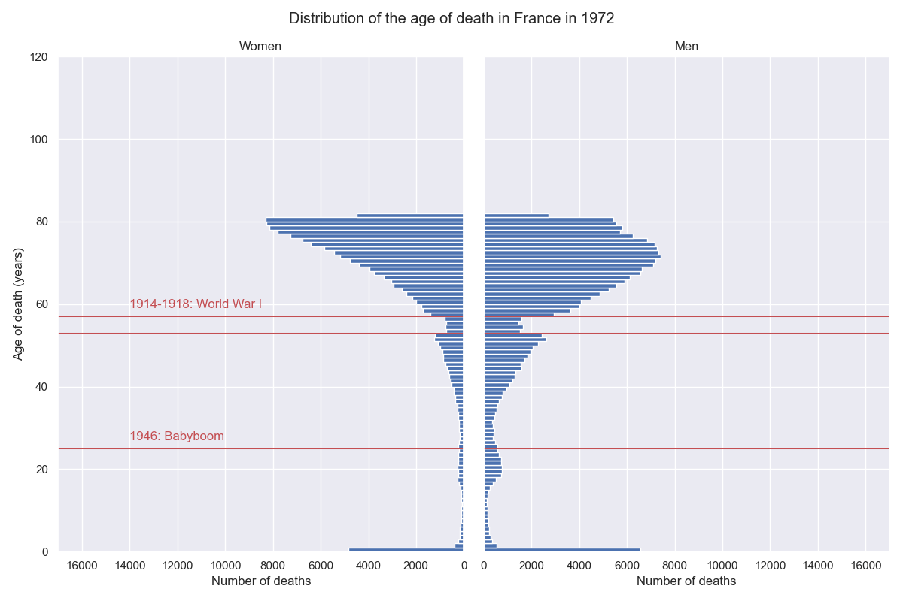

# Animating the French deaths

The Jupyter notebook [french_deaths.ipynb](french_deaths.ipynb) helps to visualize how the statistics of the French deaths have evolved over the last 5 decades.
It contains some examples of data processing with pandas and figure animation using matplotlib.

Typical output:

Full notebook output with animations on <https://boileaum.github.io/french_deaths/>.

